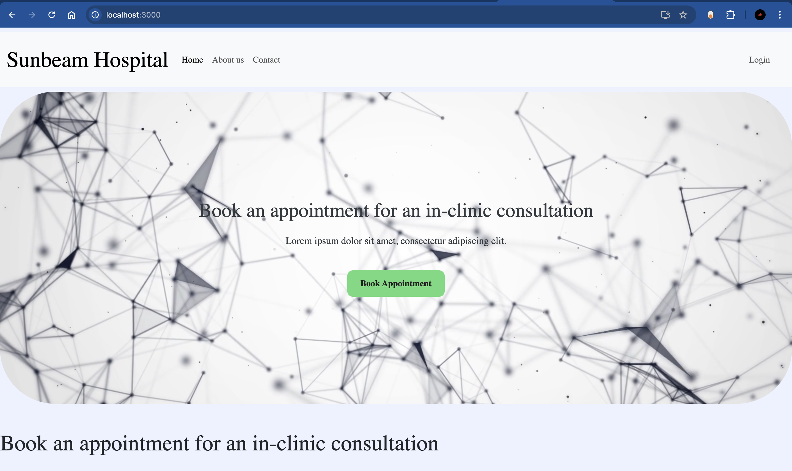
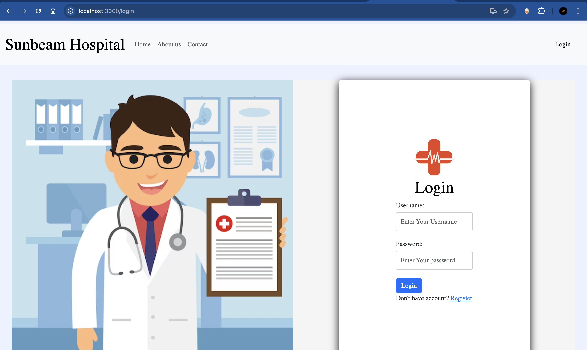
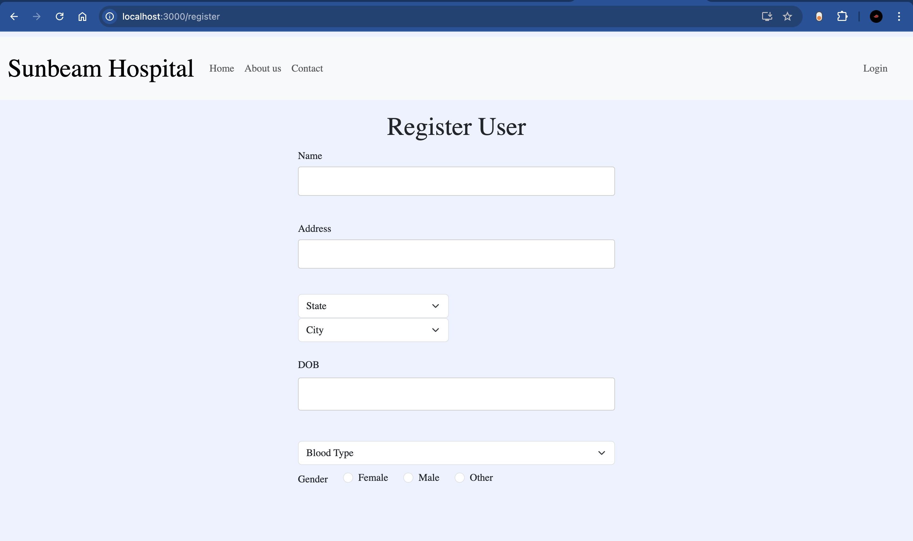
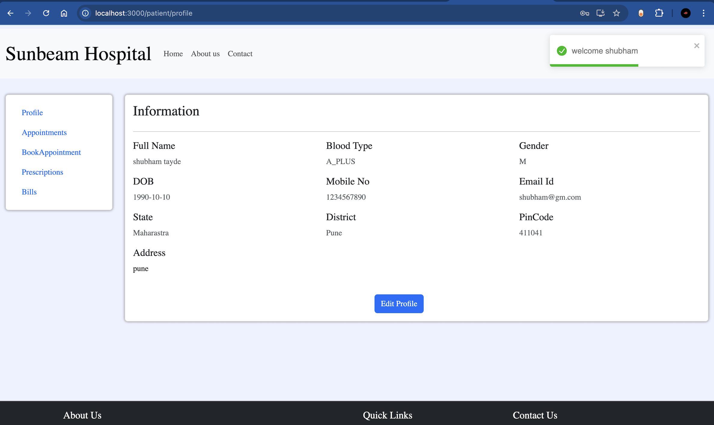
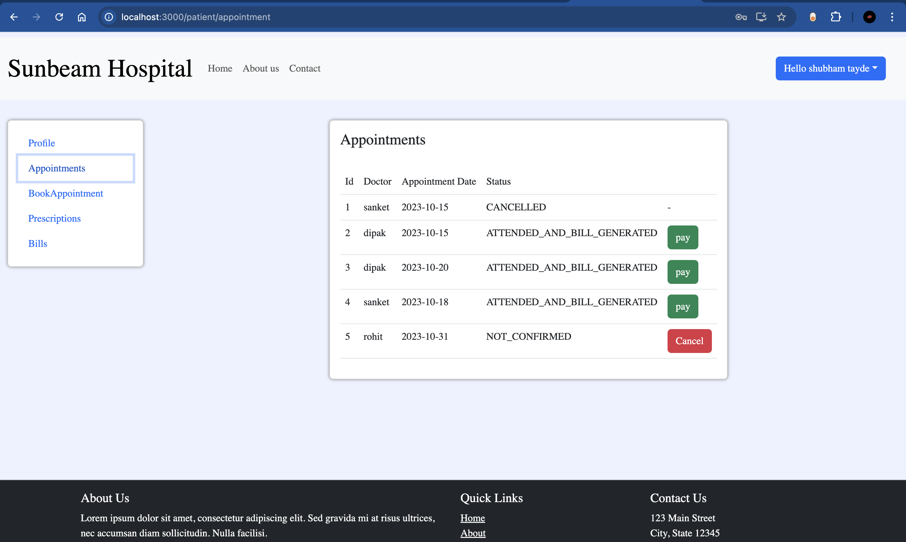
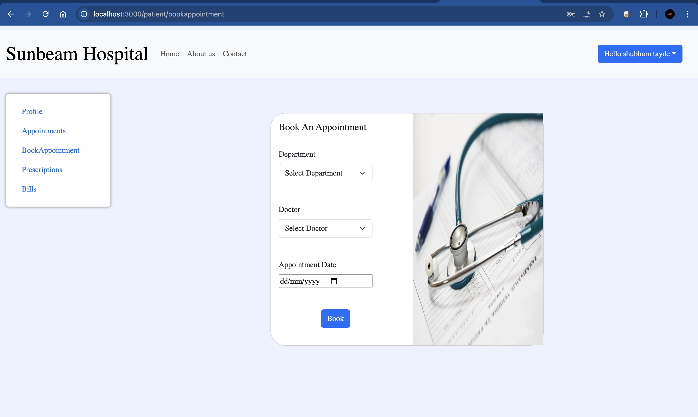
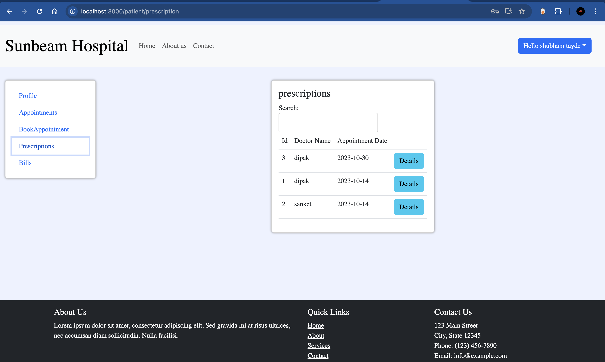
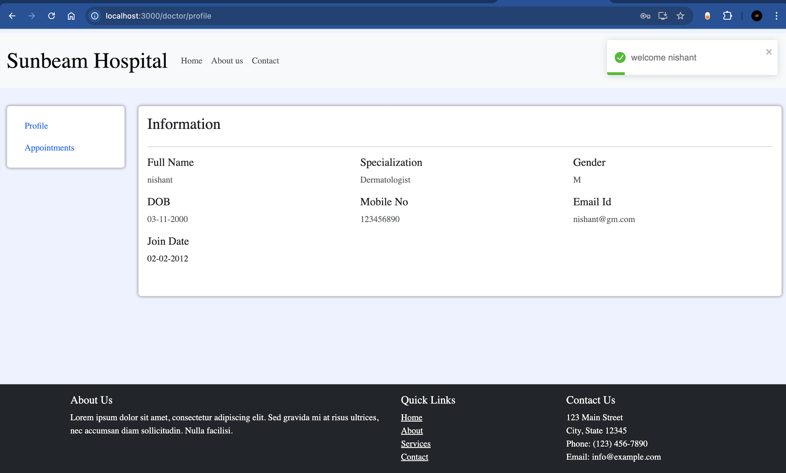
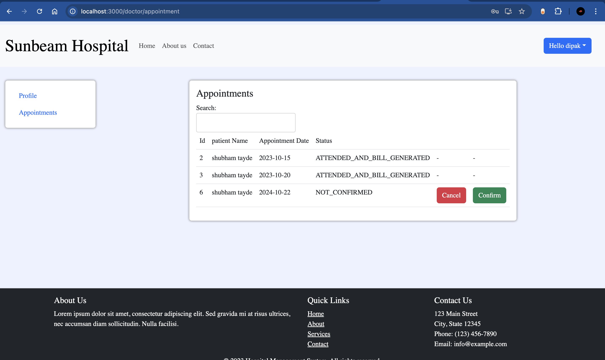
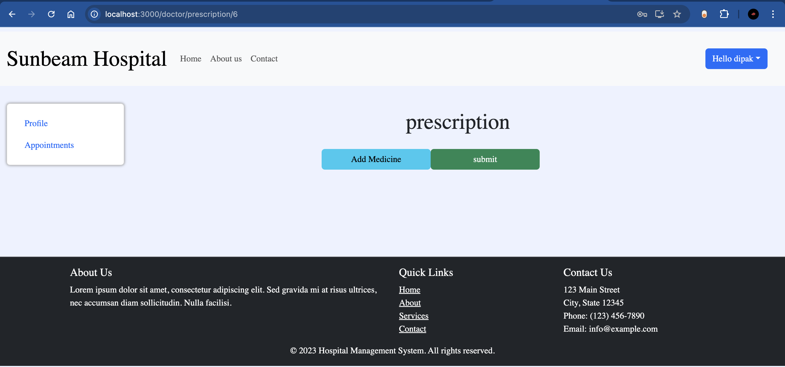

# Hospital Management System (HMS)

This is a full-stack Hospital Management System built using **React** for the frontend and **Spring Boot** for the backend. The system allows hospital staff to manage patients, doctors, appointments, and other related administrative tasks efficiently. This repository contains the complete source code for both the frontend and backend.

## Features

- **Patient Management:** Register, update, and delete patient records.
- **Doctor Management:** Add and manage doctor profiles.
- **Appointment Scheduling:** Schedule and manage appointments between doctors and patients.
- **User Authentication:** Secure login and registration for hospital staff.
- **Dashboard:** Overview of hospital metrics and activities.

## Technologies Used

- **Frontend:**
  - React
  - HTML/CSS
  - JavaScript
  - Bootstrap
  - Axios (for API calls)
  
- **Backend:**
  - Spring Boot
  - Java
  - Spring Security (for authentication)
  - Hibernate (for ORM)
  - MySQL (for database)
  - Maven (for dependency management)

## Prerequisites

To run this project locally, you will need to have the following software installed on your machine:

- **Node.js** (v14.x or later)
- **npm** (v6.x or later) or **yarn** (optional)
- **Java JDK** (v11 or later)
- **MySQL** (v8.x or later)
- **Maven** (v3.x or later)

## Getting Started

Follow the steps below to set up and run the project on your local machine.

### 1. Clone the Repository

Start by cloning this repository to your local machine.

```bash
git clone https://github.com/giridhar9996/HMS.git
cd HMS
```

### 2. Setting Up the Backend

1. Navigate to the backend directory:

    ```bash
    cd backend
    ```

2. Configure the application properties:

    Update the database connection details in the application.properties file located at src/main/resources/application.properties.
    ```bash
    spring.datasource.username=YOUR_USERNAME
    spring.datasource.password=YOUR_PASSWORD
    ```

3. Install dependencies and build the project:

    Ensure Maven is installed, then run the following command to build the project:
    ```bash
    mvn clean install
    ```

4. Run the backend server:

    Once the build is complete, start the backend server:
    ```bash
    mvn spring-boot:run
    ```

    The backend server will run at http://localhost:8080.


### 3. Setting Up the Frontend

1. Navigate to the frontend directory:

    ```bash
    cd frontend
    ```

2. Install frontend dependencies:

    Install the necessary dependencies for the React application using npm :
    ```bash
    npm install
    ```

3. Run the React application:

    After installing dependencies, start the React development server:
    ```bash
    npm start
    ```

    The frontend will run at http://localhost:3000.


### Screenshots

1. Home Page:


2. Login Page:


3. Registration page:


4. Patient profile page:


5. Patiend Appointment page:


6. Appointment Booking page:


7. Prescriptions page:


8. Doctor's profile page:


9. Doctor's appointment page:


10. Add Prescription page:
